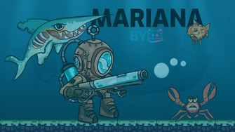
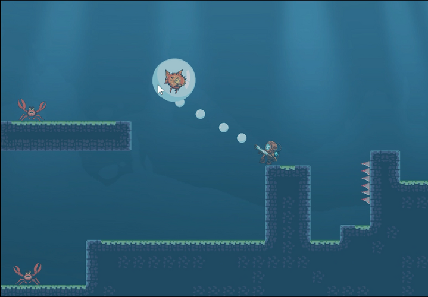
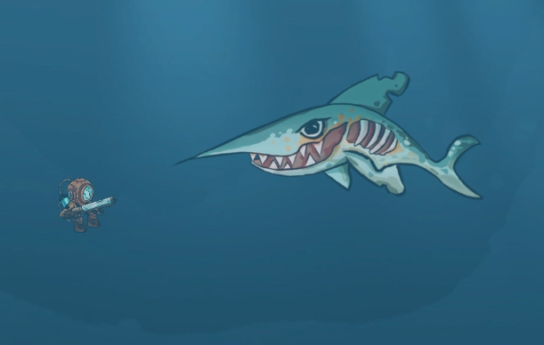
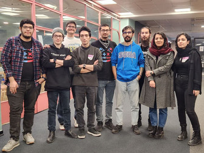

# Mariana
Global Game Jam 2025 [Published here](https://globalgamejam.org/games/2025/mariana-trench-7)

</img>

</img>

## How to play

This game is a 2D platformer about a CRAZY scientist going deep in MARIANA trench (deepest place in the world) to capture some unknown creatures!

Controls:
Go left: 'A'\
Go right: 'D'\
Jump: tap 'SPACE'\
Float(in bubble): holding 'SPACE'\
Shoot(bubble): Mouse click

You should shoot every creature you see and send them all Water surface.

Note: this game made in 48 hour.
Note: this game is OpenSource

## ScreenShots

</img>
</img>

# Team

</img>
